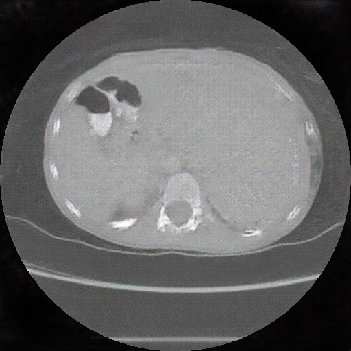

# BS-DCGAN in Tensorflow

This Tensorflow implementation of [Deep Convolutional Generative Adversarial Networks](http://arxiv.org/abs/1511.06434) was originally modified to generate artwork. The code was further modified to incorporate BatchNorm- SELU layers to generate Computer Tomography (CT) images in HD quality. The submitted EMBC conference abstract is provided under the `/assets` folder. An example of a pediatric CT image generated from the BS-DCGAN network is shown below:

## Prerequisites

- Python 3.3+
- [Tensorflow 0.12.1](https://github.com/tensorflow/tensorflow/tree/r0.12) or Tensorflow GPU
- [SciPy](http://www.scipy.org/install.html)
- [pillow](https://github.com/python-pillow/Pillow)

## Usage

First, put all the processed images (in png/ jpg format) within the `/processed` folder (please create your own in the root directory). 

Then run the following command to begin training: 
`
python main.py --data_dir=./processed --input_fname_pattern=*.png --batch_size=4 --input_height=512 --input_width=512 --output_height=512 --output_width=512 --generate_test_images=106 --dataset=nifty_ct --epoch=250 --train
`

Test images are generated at the end of training. The number of test images can be specified with the flag `generate_test_images`.

All the generated train/ test samples are within the `/samples` folder. Run `python debatch.py` to create single images from batches (you may have to change the directories and parameters within `debatch.py` accordingly). 

## Related works

- [BEGAN-tensorflow](https://github.com/carpedm20/BEGAN-tensorflow)
- [DiscoGAN-pytorch](https://github.com/carpedm20/DiscoGAN-pytorch)
- [simulated-unsupervised-tensorflow](https://github.com/carpedm20/simulated-unsupervised-tensorflow)
- [art-DCGAN](https://github.com/robbiebarrat/art-DCGAN)

## Credits

*Original Authors:* (DCGAN) Taehoon Kim / [@carpedm20](http://carpedm20.github.io/) (Scraper, artDCGAN) Robbie Barrat / [@robbiebarrat](robbiebarrat@gmail.com) / (BS-DCGAN) Chi Nok Enoch Kan [@enochk22] (kanxx030@gmail.com)
